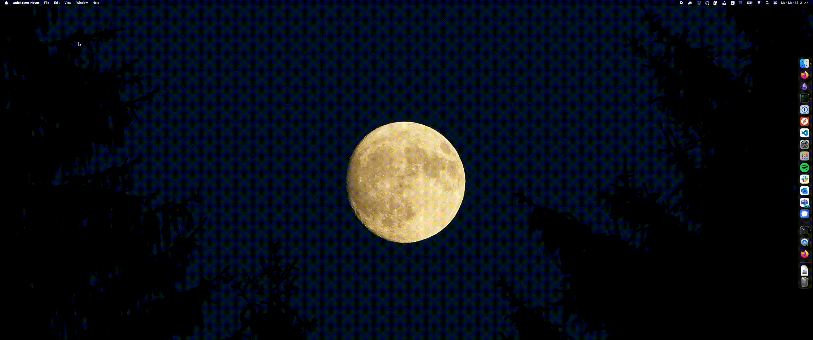

# Yabai for Ultrawide monitors

### Are you also tired of ginormous windows?
`resize_ultrawide` is a tool designed to work hand in hand with [yabai](https://github.com/koekeishiya/yabai) tiling manager. It allows for dynamic resizing and management of window layouts, making it easier to organize your workspace efficiently.



## Features

- **Dynamic Resizing**: Automatically adjusts window sizes based on predefined layouts or user specifications.
- **Space Management**: Toggle the management state of specific spaces to control which layouts affect them.
- **Customizable Shortcuts**: Integrate with macOS shortcuts to trigger resizing and layout changes effortlessly.
- **Notification Support**: Receive notifications for the toggle options.

## Installation

#### Just clone `resize_ultrawide` directly into your [yabai](https://github.com/koekeishiya/yabai) folder:
`git clone https://github.com/yourusername/resize_ultrawide.git ~/.config/yabai`
#### Change dir into the application
`cd ~/.config/yabai/resize_ultrawide`

### Install dependencies
`pip install ./requirements.txt`

### Add the listeners that you need to resize dynamically whenever new windows get added and removed

```
yabai -m signal --add event=window_created action="~/.config/yabai/resize_ultrawide/resize_window.py -r"
yabai -m signal --add event=window_destroyed action="~/.config/yabai/resize_ultrawide/resize_window.py -r"
yabai -m signal --add event=application_launched action="~/.config/yabai/resize_ultrawide/resize_window.py -r"
yabai -m signal --add event=application_terminated action="~/.config/yabai/resize_ultrawide/resize_window.py -r"
```

### Add the [skhd](https://github.com/koekeishiya/skhd) toggle on of settings for easy management
```
ctrl + alt - t : ~/.config/yabai/resize_ultrawide/resize_window.py --toggle_manage_space
shift + cmd - t : ~/.config/yabai/resize_ultrawide/resize_window.py --toggle_manage
```

### Config file
#### create your config file from the 
`cp template_config.yml config.yml`

#### now configure...
* rename your display
```yaml
displays:
  <your_display>:
```
* configure padding. set the default to your liking
* Insert your UUID. Can be found here: `yabai -m query --displays`
* your hard stop manage window count
```yaml
displays:
  <your_display>:
    default_padding: <your predefined padding>
    stop_manage_at: 4
    uuid: <your monitors UUID>
    window_count_<x>:
      padding: <padding that makes sense for your screen size>
```
* flip can be used if you want new window to flip from horizontal direction to vertical on a specific window count.
```yaml
displays:
  <your_display>:
    window_count_<x>:
      flip: true
```
* windows_blacklist are just list of items you don't want managed by the resizer 
```yaml
windows_blacklist:
  app:
  - System Settings
  - <some other application>
```
* you can specify which spaces you want un/managed however this flag can also be managed via cmd: `./resize_window.py --toggle_manage_space`
```yaml
space:
  s_1:
    managed: true
```
* same goes for global management: `./resize_window.py --toggle_manage`
```yaml
managed: true
```

##### example... works well with following frame: `yabai -m query --displays` - `"frame":{"w":3440.0000,"h":1440.0000}`
```yaml
debug: false
displays:
  samsung_ultrawide:
    default_padding: 8
    stop_manage_at: 4
    uuid: <insert your own uuid. Find here --> yabai -m query --displays> 
    window_count_1:
      padding: 1700
    window_count_2:
      padding: 850
    window_count_3:
      flip: true
      padding: default_padding
log_file: resize_ultrawide.log
managed: true
space:
  s_1:
    managed: false
  s_2:
    managed: true
  s_3:
    managed: true
  s_4:
    managed: true
  s_5:
    managed: true
  s_6:
    managed: true
  s_7:
    managed: true
  s_8:
    managed: false
  s_9:
    managed: false
windows_blacklist:
  app:
  - System Settings
  subrole:
  - AXDialog

```


## usage
#### however [yabai](https://github.com/koekeishiya/yabai) should be listening for the application
* Trigger resize
`./resize_window.py -r`  
* Global management toggle
`./resize_window.py --toggle_manage`
* Specifies the space to toggle manage
`./resize_window.py --toggle_manage_space` 


## Dependencies
* Python 3.x
* PyYAML
* argparse


## Author: Símun Højgaard Lutzen | simunhojgaard@gmail.com